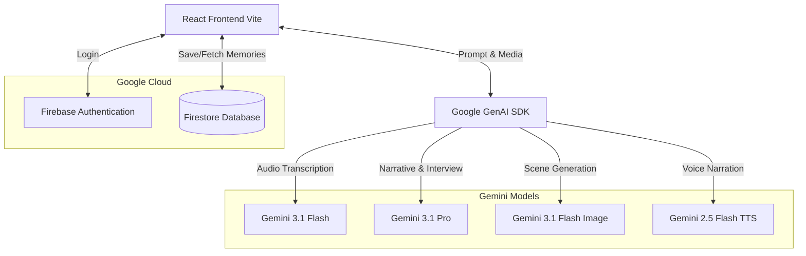

# EchoLens 📸✨

**Hackathon Category:** Creative Storyteller

EchoLens is a next-generation AI Agent that acts as your personal creative director. It leverages Gemini's native interleaved output capabilities to seamlessly weave together text, images, and audio into a single, fluid storytelling experience. Built entirely on Google Cloud and powered by the Google GenAI SDK.

## 🏆 Hackathon Alignment (Creative Storyteller)
- **Multimodal Inputs:** Accepts voice (audio), text, and images as memory prompts.
- **Interleaved Output:** Generates a rich, mixed-media response combining narrative text, inline generated illustrations (Gemini 3.1 Flash Image), and voiceover narration (Gemini 2.5 Flash TTS) in one cohesive flow.
- **Google Cloud Hosted:** Backend runs on Google Cloud Firestore and Firebase Authentication.

## 🏗 Architecture



## 📝 Devpost Submission Details

### 💡 Inspiration
I have thousands of photos sitting in my camera roll, but the *stories* behind them fade away. Standard journaling feels like a chore, and looking at old photos often lacks the emotional context of the moment. I asked myself: *What if an AI could act as my personal Creative Director, turning my messy, fragmented memories into a beautifully preserved cinematic experience?* That lightbulb moment led me to build EchoLens.

### ⚙️ What it does
EchoLens is a multimodal AI agent built specifically for the **Creative Storyteller** track. It moves completely beyond the standard "text-in/text-out" chat box. 

Here is the flow: You simply speak a raw memory into the app. The agent transcribes it in real-time. If your memory is a bit vague, the agent enters **Interview Mode**, asking a deep, evocative follow-up question to pull out sensory details. Once it has the full picture, the agent leverages Gemini's native interleaved output capabilities to generate a rich, mixed-media response. It seamlessly weaves together narrative text with custom, inline illustrations (generated on the fly to match each scene). Finally, it uses TTS to provide a warm voiceover narration. All of this is securely saved to a personal, searchable archive hosted on Google Cloud.

### 🛠 How I built it
I wanted EchoLens to feel incredibly fast, so I started by setting up a React frontend using Vite and styled it with Tailwind CSS to get that dark, cinematic look quickly. 

Instead of building a traditional backend, I went completely serverless using Google Cloud. I wired up Firebase Authentication so users could easily log in with their Google accounts, and I used Cloud Firestore as my NoSQL database to save the memories. 

The real heavy lifting happens on the client side using the Google GenAI SDK. I hooked up the browser's native MediaRecorder API to capture the user's voice and piped that audio directly into Gemini 3.1 Flash for near-instant transcription. 

Once I had the text, I passed it to Gemini 3.1 Pro, prompting it to act as a "creative director." The coolest part of the build was handling the interleaved output: I wrote logic to parse the narrative stream from Pro, identify scene breaks, and fire off parallel requests to Gemini 3.1 Flash Image to generate those nostalgic polaroid images on the fly. Finally, I took the completed story text and sent it to Gemini 2.5 Flash TTS to generate the audio buffer for the voiceover playback.

### ⚠️ Challenges I ran into
My biggest technical hurdle was orchestrating multiple AI modalities concurrently to achieve a true "interleaved" output. I had to design a system that could parse the narrative text stream from Gemini 3.1 Pro, identify scene breaks, and immediately trigger parallel requests to Gemini 3.1 Flash Image without blocking the UI. 

Additionally, I hit a wall with database limits. The high-quality base64 image strings returned by the Gemini Image model were massive, quickly exceeding Firestore's 1MB document limit. I hacked together a custom, client-side HTML5 Canvas compression algorithm that compresses the images on the fly before they are saved to Google Cloud, ensuring fast load times and efficient storage without sacrificing visual quality.

### 🏆 Accomplishments that I'm proud of
I am incredibly proud of breaking out of the standard "chatbot" UI. EchoLens feels like a premium, cinematic storytelling tool. I successfully integrated *four* different Gemini models into a single, cohesive workflow that feels instantaneous to the user. Building a fully functional, secure, and multimodal application entirely on Google Cloud infrastructure as a solo developer over a hackathon weekend is a massive win for me.

### 🧠 What I learned
This project was a masterclass in multimodal AI orchestration. I learned how to effectively manage Gemini's native interleaved output capabilities and how to handle complex state management in React when dealing with multiple asynchronous AI streams (text, image, and audio). I also leveled up my Google Cloud skills, specifically around optimizing large media payloads for NoSQL databases.

### 🚀 What's next for EchoLens
I want to expand EchoLens's multimodal inputs to allow users to upload their actual vintage photos. Using Gemini Vision, the agent will analyze the real photos and weave them directly into the generated story alongside the AI illustrations. I also plan to add collaborative "Family Archives," where multiple family members can contribute their own voice memos to build a shared, multi-perspective story of a single event!

## 🧪 Reproducible Testing Instructions (For Judges)

To verify the multimodal capabilities, interleaved output, and Google Cloud integration, please follow these steps to test the application:

1. **Authentication (Firebase):** Open the live URL or your local build. Click "Sign in with Google" to authenticate. This creates a secure, user-scoped session backed by Google Cloud.
2. **Multimodal Input (Audio):** Navigate to the "Studio" tab. Click the microphone icon ("Voice Memo"). Allow microphone permissions and speak a brief memory (e.g., *"I remember my first trip to the beach when I was five. The water was freezing."*). Click stop. You will see **Gemini 3.1 Flash** transcribe the audio instantly.
3. **Agentic Interaction (Interview Mode):** Click the "Ask Follow-up" button. **Gemini 3.1 Pro** will analyze your transcript and ask a contextual question to draw out more sensory details. Type a brief answer and click "Generate Story".
4. **Interleaved Output (Text + Images):** Watch the Storyteller view. You will see **Gemini 3.1 Pro** streaming the narrative text while simultaneously triggering **Gemini 3.1 Flash Image** to generate and insert custom polaroid-style illustrations inline with the story.
5. **Multimodal Output (TTS):** Once generation is complete, click the "Listen" button at the top of the story. **Gemini 2.5 Flash TTS** will narrate the generated story back to you.
6. **Cloud Persistence (Firestore):** Click the "Save" button. Navigate to the "Archive" tab. You will see your memory securely saved and retrieved from **Google Cloud Firestore**. You can use the search bar to filter your saved memories.

## 🚀 Spin-up Instructions

### Prerequisites
- Node.js (v18+)
- A Google Cloud / Firebase Project
- A Gemini API Key from Google AI Studio

### Local Setup

1. **Clone the repository:**
   ```bash
   git clone <your-repo-url>
   cd echolens
   ```

2. **Install dependencies:**
   ```bash
   npm install
   ```

3. **Environment Variables:**
   Create a `.env` file in the root directory and add your Gemini API key:
   ```env
   VITE_GEMINI_API_KEY=your_gemini_api_key_here
   ```

4. **Firebase Setup:**
   - Go to the [Firebase Console](https://console.firebase.google.com/).
   - Create a new project and enable **Firestore Database** and **Authentication** (Google Sign-In).
   - Register a web app and copy the Firebase config object.
   - Replace the config in `src/firebase.ts` with your project's configuration.

5. **Run the development server:**
   ```bash
   npm run dev
   ```
   The app will be available at `http://localhost:3000`.

### Cloud Deployment (Google Cloud / Firebase Hosting)

1. Build the production application:
   ```bash
   npm run build
   ```

2. Install the Firebase CLI and login:
   ```bash
   npm install -g firebase-tools
   firebase login
   ```

3. Initialize Firebase Hosting:
   ```bash
   firebase init hosting
   ```
   - Select your existing Firebase project.
   - Set the public directory to `dist`.
   - Configure as a single-page app (Yes).
   - Do not overwrite `index.html`.

4. Deploy to Google Cloud:
   ```bash
   firebase deploy --only hosting
   ```
